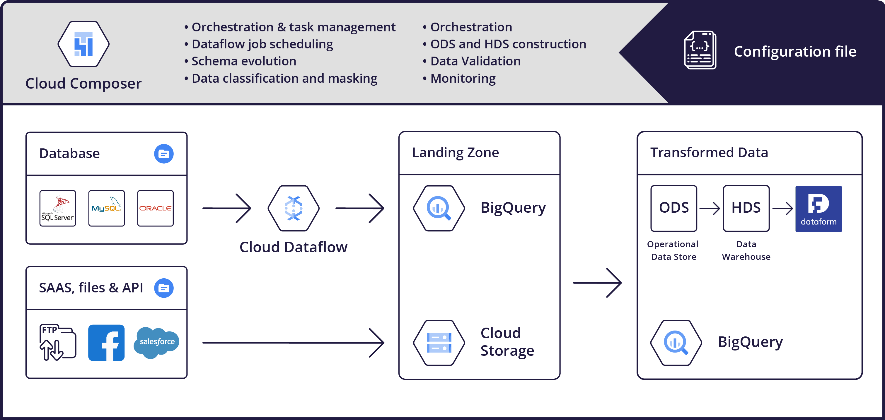

# gcp-airflow-foundations
[](https://badge.fury.io/py/gcp-airflow-foundations)
[](https://storage.googleapis.com/public-cloudbuild/build/cloudbuild_status.svg)
[](https://gcp-airflow-foundations.readthedocs.io/en/latest/?badge=latest)




Airflow is an awesome open source orchestration framework that is the go-to for building data ingestion pipelines on GCP (using Composer - a hosted AIrflow service). However, most companies using it face the same set of problems
- **Learning curve**: Airflow requires python knowledge and has some gotchas that take time to learn. Further, writing Python DAGs for every single table that needs to get ingested becomes cumbersome. Most companies end up building utilities for creating DAGs out of configuration files to simplify DAG creation and to allow non-developers to configure ingestion
- **Datalake and data pipelines design best practices**: Airflow only provides the building blocks, users are still required to understand and implement the nuances of building a proper ingestion pipelines for the data lake/data warehouse platform they are using
- **Core reusability and best practice enforcement across the enterprise**: Usually each team maintains its own Airflow source code and deployment

We have written an opinionated yet flexible ingestion framework for building an ingestion pipeline into data warehouse in BigQuery that supports the following features:

- **Zero-code**, config file based ingestion - anybody can start ingesting from the growing number of sources by just providing a simple configuration file. Zero python or Airflow knowledge is required.
- **Modular and extendable** - The core of the framework is a lightweight library. Ingestion sources are added as plugins. Adding a new source can be done by extending the provided base classes.
- **Opinionated automatic creation of  ODS (Operational Data Store ) and HDS (Historical Data Store)** in BigQuery while enforcing best practices such as schema migration, data quality validation, idempotency, partitioning, etc.
- **Dataflow job support** for ingesting large datasets from SQL sources and deploying jobs into a specific network or shared VPC.
- Support of **advanced Airflow features** for job prioritization such as slots and priorities.
- Integration with **GCP data services** such as DLP and Data Catalog [work in progress].
- **Well tested** - We maintain a rich suite of both unit and integration tests.

## Installing from PyPI
```bash
pip install 'gcp-airflow-foundations'
```

## Full Documentation 
See the [gcp-airflow-foundations documentation](https://gcp-airflow-foundations.readthedocs.io/en/latest/) for more details.

## Running locally
### Using Service Account
- Create a service account in GCP, and save it as ```helpers/key/keys.json``` (don't worry, it is in .gitignore, and will not be push to the git repo)
- Run Airflow locally (Airflow UI will be accessible at http://localhost:8080): ```docker-compose up```
### Using user IAM
- uncomment like 11 in ```docker-composer.yaml```
- send env var PROJECT_ID to your test project
- Authorize gcloud to access the Cloud Platform with Google user credentials: ```helpers/scripts/gcp-auth.sh```
- Run Airflow locally (Airflow UI will be accessible at http://localhost:8080): ```docker-compose up```
### Running tests
- Run unit tests ```./tests/airflow  "pytest tests/unit```
- Run unit tests with coverage report ```./tests/airflow  "pytest --cov=gcp_airflow_foundations tests/unit```
- Run integration tests ```./tests/airflow  "pytest tests/integration```
- Rebuild docker image if requirements changed: ```docker-compose build```
### Sample DAGs
Sample DAGs that ingest publicly available GCS files can be found in the dags folder, and are started as soon Airflow is ran locally
# Contributing
## Install pre-commit hook
Install pre-commit hooks for linting, format checking, etc.

- Install pre-commit python lib locally ```pip install pre-commit```
- Install the pre-commit hooks for the repo```pre-commit install```
