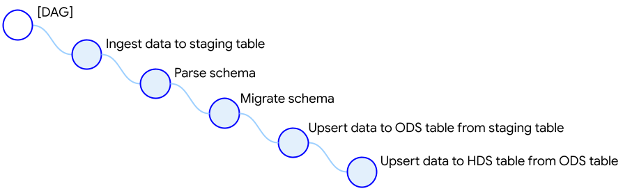

********************
Extracting Data
********************

.. overview:
1. Overview
========================
The building blocks of the data ingestion DAG are pre-defined in GCP Airflow Foundations, such that the user only needs to configure the parameters of the data ingestion.
The data ingestion follows a set of default steps:

- The first step in the ingestion pipeline is to extract the data from a source and load them to a landing table in BigQuery. 
- The schema of the landing stable is parsed and compared with the schema of the destination tables. 
- If any schema changes are detected, these are migrated to the destination table. 
- Finally, the data are upserted to the destination tables. 

This can be visualized in the tree diagram bellow:

.. dag_generation:
2. Config Based DAG Generation
========================
GCP Airflow Foundations support the dynamic generation of ETL/ELT DAGs from simple, user-provided configuation files written in YAML.
At minimum, the user declares in the configuration file the derised ingestion mode and the type of the data source, along with the required source tables to be ingested.
Optionally, additional parameters can be provided, such us metadata naming and column mapping between the source and destination tables, among others.
GCP Airflow Foundations will parse the information declared in the YAML file to generate the building blocks necessary for generating the DAGs for the desired data ingestion.

For a detailed description and data type of each configuration field, please refer to :class:`gcp_airflow_foundations.base_class.source_config.SourceConfig` 
and :class:`gcp_airflow_foundations.base_class.source_table_config.SourceTableConfig` for the ingestion source and tables respectively.

An example of a simple configuration file to extract marketing data from Facebook:

.. code-block:: yaml

    source:
        name: facebook_campaigns_ingestion
        source_type: FACEBOOK
        ingest_schedule: "@daily"
        start_date: "2021-01-01"
        dataset_data_name: facebook
        landing_zone_options:
            landing_zone_dataset: landing_zone
        facebook_options:
            account_lookup_scope: full
            fields: [
                "account_id",
                "campaign_id", 
                "impressions",
                "spend",
                "reach",
                "clicks"]
            level: campaign
            time_increment: "1"
    tables:
        - table_name: campaign_insights
            surrogate_keys: ["account_id", "campaign_id", "date_start"]
            ingestion_type: INCREMENTAL
            facebook_table_config:
                breakdowns: null
                action_breakdowns: ["action_type"]
        - table_name: campaign_insights_platform_placement
            surrogate_keys: ["account_id", "campaign_id", "date_start", "publisher_platform", "platform_position"]
            ingestion_type: INCREMENTAL
            facebook_table_config:
                breakdowns:  ["publisher_platform", "platform_position"]
                action_breakdowns: ["action_type"]

.. schedule:
3. Replication Scheduling
========================
In the ``ingest_schedule`` field you can select the ingestion schedule for Airflow. 
GCP Airflow Foundations currently support hourly, daily, weekly, and monthly intervals.

.. source_selection:
4. Source Selection
========================

To declare the data source for an ingestion, you only need to provide an alias for your souce in the ``name`` field, as well as define the ``source_type``. 
The latter is an enumaration-type field.

For every data source you will be extracting data from, you need to configurate the corresponding Airflow Connection in Airflow's GUI by providing the required
credentials.

.. ingestion_type
5. Ingestion Type
========================
GCP Airflow Foundations support both full and incremental ingestions. In the former, the lifetime range of data is extracted from the data source at every ingestion
and the destination table is truncated with the new records. In the latter, the declared ingestion schedule is used as a time range to query the source data available within
that time interval and the records are used to update the destination table. The ingestion type must be declared in the ``ingestion_type`` field for each table.
Note that you can select a different ingestion type for each table.

.. table_selection:
6. Table Selection
========================

The next step after having selected a data source, is to select the individual tables you need to extract data from. The ``tables`` field is a list-type field, whose entries
are single tables. Start by giving an alias in the ``table_name`` field. Next, in the ``surrogate_keys`` field you need to set the columns that will be used as a key to select unique records.
These are usually record identifier fields, as well as breakdown dimension fields (e.g. date, geography fields, etc.). 

.. ods:
6.1 Configuring an Operational Data Store (ODS)
-----------------------------------------------

By default, the destination table will be an Operational Data Store (ODS). An Operational Data Store (ODS) is a table that provides a snapshot of 
the latest data for operational reporting. As newer records become available, the ODS continuously overwrites older data with either full or incremental data ingestions. 
With full ingestions, the entire ODS is replaced with the updated data, whereas with incremental ingestions only the difference between the target and source data is loaded. 

The ODS table will include four metadata columns for each table row:

.. list-table:: ODS Metadata Columns
   :widths: 33 33 33
   :header-rows: 1

   * - Key
     - Default Name
     - Description
   * - hash_column_name
     - metadata_row_hash
     - The entire row hash
   * - primary_key_hash_column_name
     - metadata_primary_key_hash
     - The hash of the primary keys
   * - ingestion_time_column_name
     - metadata_inserted_at
     - The ingestion time
   * - update_time_column_name
     - metadata_updated_at
     - The update time

Optionally, the user can override the default metadata column names for each table by providing the ``ods_config.ods_metadata`` field. For example:

.. code-block:: yaml

    tables:
        - table_name: campaign_insights
            surrogate_keys: ["account_id", "campaign_id", "date_start"]
            ingestion_type: INCREMENTAL
            facebook_table_config:
                breakdowns: null
                action_breakdowns: ["action_type"]
                column_mapping:
                    date_start: date
            ods_config:
                ods_metadata:
                    hash_column_name: metadata_row_hash
                    primary_key_hash_column_name: metadata_primary_key_hash
                    ingestion_time_column_name: metadata_inserted_at
                    update_time_column_name: metadata_updated_at

.. hds:
6.2 Configuring a Historical Data Store (HDS)
-----------------------------------------------

In addition to an ODS destination table, the data can also be ingested in a Historical Data Store (HDS) table. 
To implement an HDS table, the user can select between a Slowly Changing Diemension Type 2 (SCD2) and a `snapshot <https://maximebeauchemin.medium.com/functional-data-engineering-a-modern-paradigm-for-batch-data-processing-2327ec32c42a>`_.

6.2.1 Slowly Changing Diemension Type 2 (SCD2)
^^^^^^^^^^^^^^^^^^^^^^^^^^^^^^^^^^^^^^^^^^^^^^
In SCD2, a new row is inserted for each change to an existing record in the corresponding target table, as well as for entirely new records. 
Each record row has metadata timestamp columns that indicate the time of insertion, update, and expiration.

6.2.2 Snapshot
^^^^^^^^^^^^^^^^^^^^^^^^^^^^^^^^^^^^^^^^^^^^^^
With snapshots, a new partition is appended to the target table at each ETL schedule. 
Therefore, the target table comprises a collection of snapshots where each partition contains the full dimension at a point in time.

6.2.3 Comparison of SCD2 and Snapshotting
^^^^^^^^^^^^^^^^^^^^^^^^^^^^^^^^^^^^^^^^^^^^^^
- Even though the SCD2 approach is more computationally efficient, it is also more difficult to maintain and reproduce. Snapshot tables, on the other hand, do not require complex transformations.
- Snapshot tables result in significantly larger tables (since all data is replicated every day) which can result in higher storage costs.  However using properly partitioned BigQuery tables mitigates this - partitioned older than 90 days (if they have not been edited) are automatically moved to Big Query long term storage.
- Querying data from a specific day or time ranges is cheaper when using properly partitioned snapshot tables since BigQuery will scan the data only in the appropriate partitions. While doing the same query on SCD2 tables will result in a  full table scan. 
- Snapshot tables are more intuitive to work with - querying data from a specific date can use the exact same SQL queries used for ODS with the simple addition of filter cluse for that day. While SCD2 requires more complex logic using the created_at and expired_at columns.
- Snapshot tables follow the  “functional data engineering ” principle. Most importantly operations are idempotent such that re-running ingestion for the same day will not result in data duplicates or corrupt data. 
- Expiring old data is easier with snapshot tables.

6.2.4 Ingesting Data to an HDS Table
^^^^^^^^^^^^^^^^^^^^^^^^^^^^^^^^^^^^^^^^^^^^^^
To configure an HDS ingestion, the user has to declare the HDS type in under each table. For example:

.. code-block:: yaml

    tables:
        - table_name: campaign_insights
            surrogate_keys: ["account_id", "campaign_id", "date_start"]
            ingestion_type: INCREMENTAL
            facebook_table_config:
                breakdowns: null
                action_breakdowns: ["action_type"]
                column_mapping:
                    date_start: date
            hds_config:
                hds_table_type: SNAPSHOT
                hds_table_time_partitioning: DAY
                hds_metadata:
                    eff_start_time_column_name: metadata_created_at
                    eff_end_time_column_name: metadata_expired_at
                    hash_column_name: metadata_row_hash
                    
Note that the ``hds_metadata`` field is optional. If not provided the default column names will be used. 
Also note that the ``hds_table_time_partitioning`` is only needed for snapshot-type HDS tables,
in which case it must match the ingestion schedule.

The HDS table will include four metadata columns for each table row:

.. list-table:: HDS Metadata Columns
   :widths: 33 33 33
   :header-rows: 1

   * - Key
     - Default Name
     - Description
   * - hash_column_name
     - metadata_row_hash
     - The entire row hash
   * - eff_end_time_column_name
     - metadata_expired_at
     - The expiration time (if any)
   * - eff_start_time_column_name
     - metadata_created_at
     - The ingestion time

.. dataset:
7. Landing and Destination Datasets
========================
The ingested data will first be stored in a temporary, landing table in BigQuery.
The dataset name of the landing tables must be provided in the ``landing_zone_options.landing_zone_dataset`` field.
From the landing dataset, the data are upserted in the destination tables. The destination dataset can be selected in the 
``dataset_data_name``. 

.. note:: 
    The landing tables are deleted after ingestion.

.. mapping:
8. Column Mapping
========================
Both ODS and HDS ingestions support column mapping and schema migration. 
When a data field in the data source is desired to have a different name in the destination table,
then, the ``column_mapping`` field can be declared. This is a map-type field, whose keys are the names of columns as they
appear in the data source, and the keys are the corresponding names that these columns should have in the destination table.

For example:

.. code-block:: yaml

    tables:
        - table_name: campaign_insights
            surrogate_keys: ["account_id", "campaign_id", "date_start"]
            ingestion_type: INCREMENTAL
            facebook_table_config:
                breakdowns: null 
                action_breakdowns: ["action_type"]
                column_mapping:
                    date_start: date

In this example, the ``date_start`` field extracted from Facebook's API will be mapped to the ``date`` field in the destination tables.
